# Intern Tracker — MERN Stack

A full-stack intern management system built with **MongoDB, Express, React, and Node.js**. Features a luxury glassmorphism dark UI with animated mesh gradient background, gradient typography, pulsing status badges, and smooth micro-interactions.

---
## Submitted By
- Name : Muaaz Tasawar
- Email : muaaztasawar1@gmail.com
- Submission date : 03/14/2026 

## Screenshots

### 1. Dashboard — Full Intern List
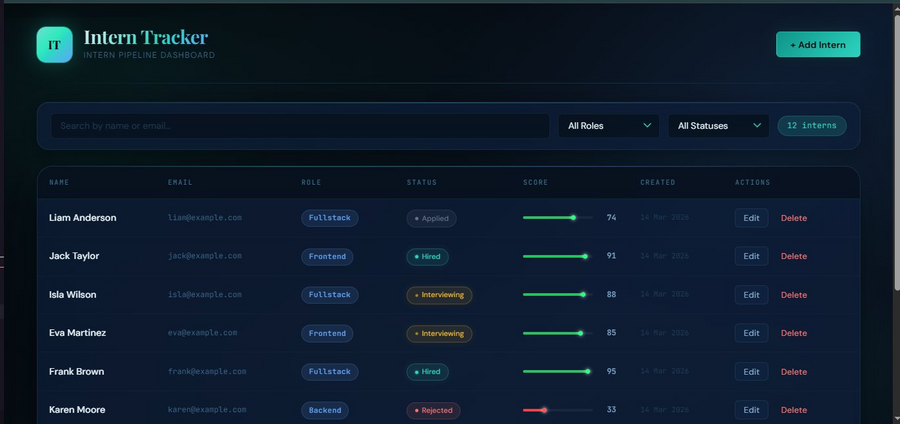

### 2. Search by Name or Email (Real-time, Debounced)
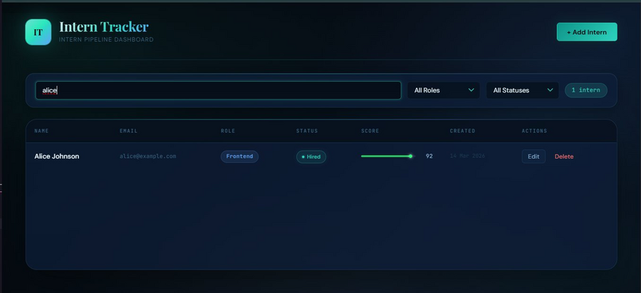

### 3. Role Dropdown
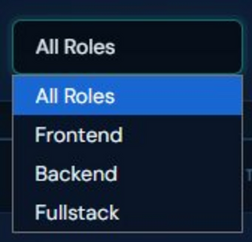

### 4. Role Filter Active — Frontend (4 interns)
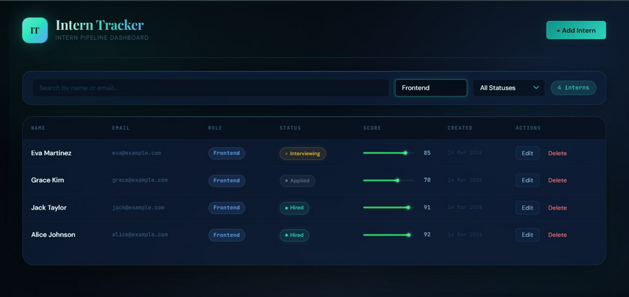

### 5. Status Dropdown
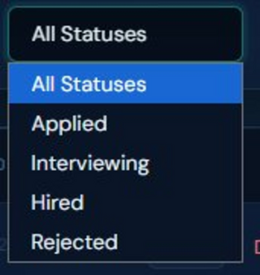

### 6. Combined Filter — Frontend + Hired (2 interns)
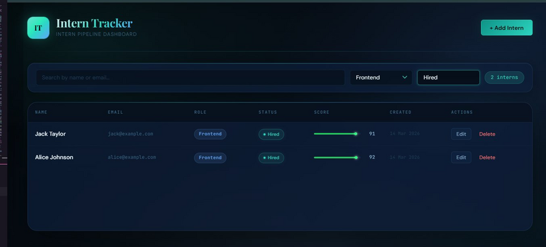

### 7. Add Intern Modal
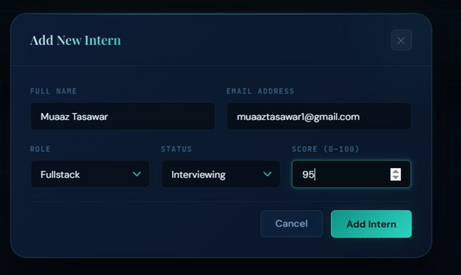

### 8. After Adding — Counter Updates to 13
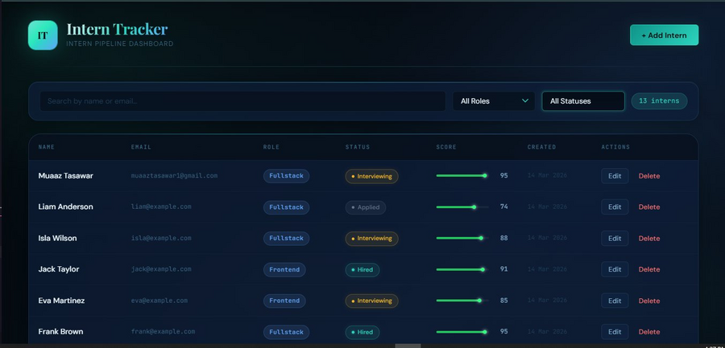

### 9. Edit Intern Modal (Pre-filled)
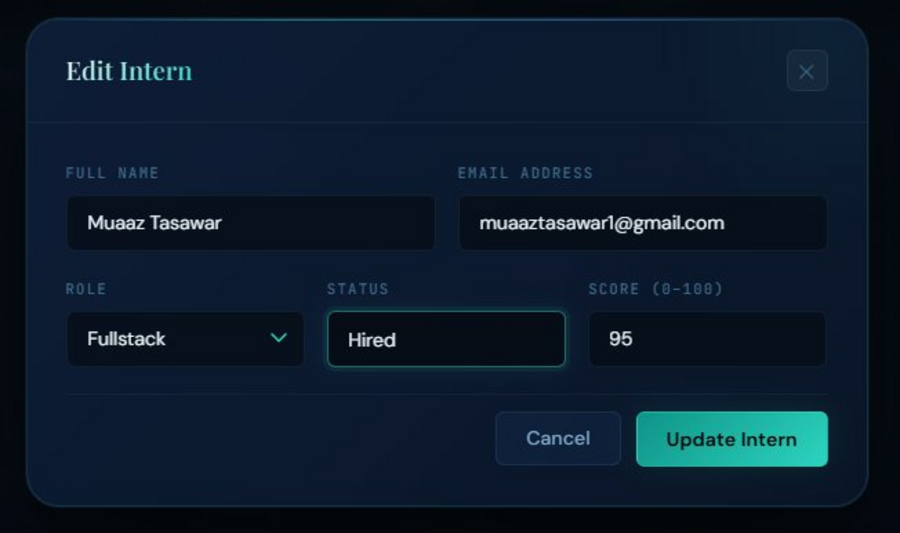

### 10. After Edit — Status Updated to Hired
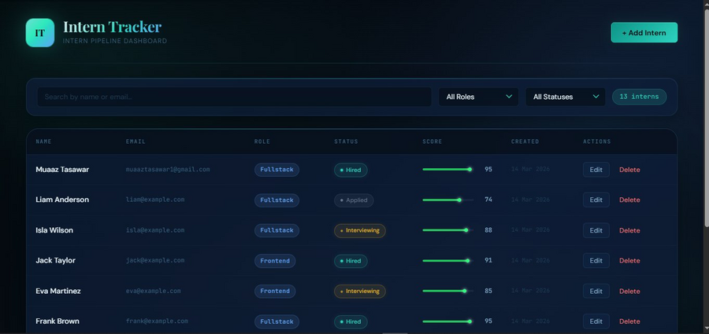

### 11. Delete Confirmation Dialog


### 12. After Delete — Back to 12 Interns
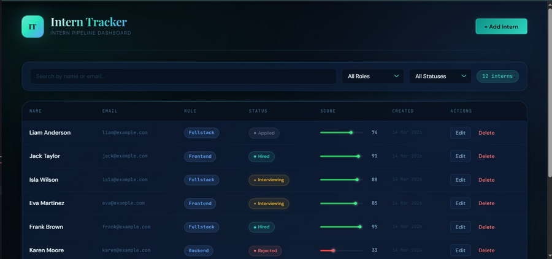

---

## Features

### Backend
- REST API with 5 endpoints (POST, GET, GET/:id, PATCH, DELETE)
- Search by name or email using MongoDB `$regex` (case-insensitive)
- Filter by role and status (combinable)
- Pagination — default 8 per page, max 50
- Centralized error middleware:
  - `ValidationError` → 422 with per-field messages
  - Duplicate email (code 11000) → 409 Conflict
  - Invalid ObjectId → 400 Bad Request
  - Not found → 404

### Frontend
- Glassmorphism dark UI with animated mesh gradient background
- Playfair Display + DM Sans + JetBrains Mono typography
- Intern table: name, email, role badge, status badge, score bar, date, actions
- Real-time debounced search (350ms)
- Role and status filter dropdowns — combinable
- Pagination controls with ellipsis
- Add Intern modal with client-side + server-side validation
- Edit Intern modal — pre-filled with existing data
- Delete with glassmorphism confirmation dialog
- Loading spinners on all API calls
- Backend error messages shown in UI
- Row stagger-in animation on load
- Pulsing dot on Interviewing status badge
- Glowing teal endpoint dot on score bars
- Hover `box-shadow` left accent on table rows
- Fully responsive (mobile-friendly)

---

## Tech Stack

| Layer     | Technology                                    |
|-----------|-----------------------------------------------|
| Frontend  | React 18, Axios                               |
| Backend   | Node.js, Express                              |
| Database  | MongoDB, Mongoose                             |
| Dev Tool  | Nodemon                                       |
| Fonts     | Playfair Display, DM Sans, JetBrains Mono     |

---

## Setup Instructions

### Prerequisites
- Node.js v18+ → https://nodejs.org
- MongoDB running locally — verify in Compass at `mongodb://localhost:27017`
- Git → https://git-scm.com

### 1. Clone the repo
```bash
git clone https://github.com/YOUR_USERNAME/intern-tracker.git
cd intern-tracker
```

### 2. Backend setup
```bash
cd backend
npm install
cp .env.example .env
```

Edit `backend/.env`:
```
PORT=5000
MONGO_URI=mongodb://localhost:27017/intern-tracker
```

### 3. Seed the database
```bash
npm run seed
```

Expected output:
```
MongoDB connected: localhost
Cleared existing interns
Seeded 12 interns
Seed complete!
```

Then open **MongoDB Compass** → refresh sidebar → you'll see the `intern-tracker` database with 12 documents in the `interns` collection.

### 4. Start the backend
```bash
npm run dev
# Server running on http://localhost:5000
```

Verify: visit `http://localhost:5000/api/health` → `{ "success": true }`

### 5. Start the frontend
```bash
cd ../frontend
npm install
npm start
# Opens http://localhost:3000
```

---

## API Endpoints

| Method | Endpoint          | Description                          |
|--------|-------------------|--------------------------------------|
| POST   | /api/interns      | Create a new intern                  |
| GET    | /api/interns      | List with search, filter, paginate   |
| GET    | /api/interns/:id  | Get single intern by ID              |
| PATCH  | /api/interns/:id  | Update intern (partial, uses `$set`) |
| DELETE | /api/interns/:id  | Delete intern                        |
| GET    | /api/health       | Health check                         |

### Query Parameters — GET /api/interns

| Param  | Example           | Description                      |
|--------|-------------------|----------------------------------|
| search | ?search=alice     | Search by name or email          |
| role   | ?role=Frontend    | Filter by role                   |
| status | ?status=Hired     | Filter by status                 |
| page   | ?page=2           | Page number (default: 1)         |
| limit  | ?limit=5          | Per page (default: 8, max: 50)   |

---

## Data Model

| Field     | Type   | Rules                                                  |
|-----------|--------|--------------------------------------------------------|
| name      | String | required, min 2 chars, trimmed                         |
| email     | String | required, unique, lowercase, valid format              |
| role      | String | Frontend \| Backend \| Fullstack                       |
| status    | String | Applied \| Interviewing \| Hired \| Rejected           |
| score     | Number | required, 0–100                                        |
| createdAt | Date   | auto (Mongoose timestamps)                             |
| updatedAt | Date   | auto (Mongoose timestamps)                             |

---

## Project Structure

```
intern-tracker/
├── .gitignore
├── README.md
├── screenshots/               ← all 12 UI screenshots
│
├── backend/
│   ├── .env                   ← secret config (NOT committed to git)
│   ├── .env.example           ← template to share
│   ├── package.json
│   ├── server.js              ← Express entry point
│   ├── seed.js                ← populate DB with 12 test interns
│   ├── config/db.js           ← MongoDB connection
│   ├── models/Intern.js       ← Mongoose schema + validation
│   ├── controllers/internController.js  ← all 5 route handlers
│   ├── routes/internRoutes.js ← URL → controller mapping
│   └── middleware/errorHandler.js  ← centralised error responses
│
└── frontend/
    ├── package.json           ← includes proxy → :5000
    ├── public/index.html
    └── src/
        ├── index.js / index.css
        ├── App.js / App.css   ← glassmorphism stylesheet
        ├── services/internApi.js     ← all Axios API calls
        ├── components/
        │   ├── Modal.js
        │   ├── InternForm.js
        │   ├── ConfirmDialog.js
        │   └── Pagination.js
        └── pages/InternList.js       ← main dashboard
```

---

## Assumptions

- Email uniqueness enforced at the database level via a unique index
- Default status for new interns is `Applied`
- Pagination defaults to 8 items per page on the frontend
- `PATCH` uses `$set` so partial updates are supported without overwriting unchanged fields
- Score is mandatory (0–100) and represents an evaluation score

---

## Author

Built as part of a MERN stack engineering assignment.
